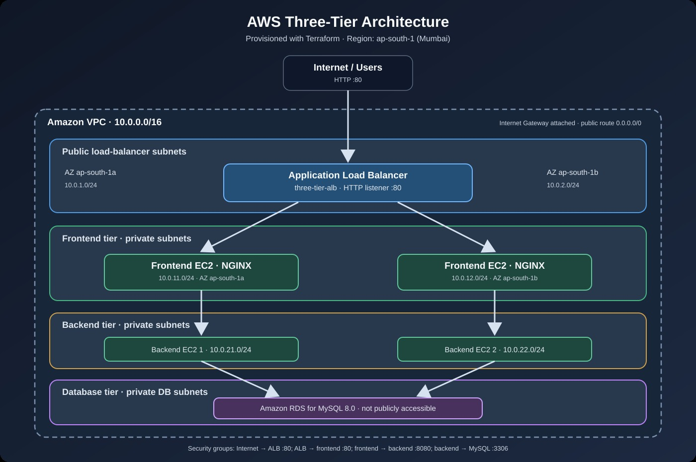

# AWS Three-Tier Architecture with Terraform

A hands-on Infrastructure as Code project that provisions a three-tier AWS network using Terraform. The design separates the public entry point, frontend web servers, backend instances, and MySQL database into dedicated subnet tiers across two Availability Zones in the Mumbai region (`ap-south-1`).

> **Learning project:** This repository demonstrates AWS networking and Terraform resource provisioning. The frontend instances serve simple NGINX pages; the backend instances currently install Python and write a marker file. A complete frontend-to-backend application workflow is not implemented yet.

## 📐 Architecture
## AWS Three-Tier Architecture



The architecture diagram is stored at `assets/three-tier-architecture.svg`. Upload that file to your repository's `assets` folder so GitHub can display the image.

### Request and Network Flow

1. Users reach the internet-facing Application Load Balancer (ALB) through the public load-balancer subnets.
2. The ALB's HTTP listener on port `80` forwards requests to the frontend target group.
3. Two NGINX frontend EC2 instances run in separate frontend subnets and are configured through EC2 user data.
4. Two backend EC2 instances run in separate backend subnets. The backend security group allows TCP port `8080` from the frontend security group.
5. Amazon RDS for MySQL runs in a DB subnet group using the two database subnets and is configured as not publicly accessible. The database security group allows TCP port `3306` from the backend security group.

**HTTPS note:** The security-group configuration allows inbound HTTPS (`443`) at the ALB security group, but the current Terraform configuration defines an HTTP listener only. HTTPS listener and certificate configuration are not included.

## ☁️ AWS Resources

| Component | Configuration |
|---|---|
| AWS Region | `ap-south-1` — Mumbai |
| VPC CIDR | `10.0.0.0/16` |
| Public load-balancer subnet 1 | `10.0.1.0/24` |
| Public load-balancer subnet 2 | `10.0.2.0/24` |
| Frontend subnet 1 | `10.0.11.0/24` |
| Frontend subnet 2 | `10.0.12.0/24` |
| Backend subnet 1 | `10.0.21.0/24` |
| Backend subnet 2 | `10.0.22.0/24` |
| Database subnet 1 | `10.0.31.0/24` |
| Database subnet 2 | `10.0.32.0/24` |
| Load Balancer | Internet-facing Application Load Balancer |
| Frontend Tier | Two EC2 instances configured with NGINX |
| Backend Tier | Two EC2 instances with basic Python bootstrap scripts |
| Database Tier | Amazon RDS for MySQL 8.0 |
| Database Instance Class | `db.t3.micro` |
| Initial DB Storage | 20 GB |
| Maximum Storage Autoscaling | 50 GB |
| Infrastructure as Code | Terraform |
| AWS Provider | HashiCorp AWS provider (`~> 6.0`) |

The AMI ID is hard-coded in the current Terraform files. Verify that it is valid in the selected region before deploying the infrastructure again.

## 🧰 Technologies Used

- Amazon Web Services (AWS)
- Amazon VPC
- Amazon EC2
- Application Load Balancer (ALB)
- Amazon RDS for MySQL
- Terraform
- Ubuntu/Linux
- NGINX
- AWS Security Groups
- Git and GitHub

## 📁 Repository Structure

```text
Terraform-Three-Tier-Project/
├── README.md
├── assets/
│   └── three-tier-architecture.svg
├── main.tf
├── provider.tf
├── variables.tf
├── backend.tf
├── frontend.tf
├── database.tf
├── alb.tf
├── internet-gateway.tf
├── public route-tables.tf
├── private route-table.tf
├── Database-route-table.tf
├── security-group.tf
├── nat.tf
├── .gitignore
└── .terraform.lock.hcl
```

This is the recommended documented layout. Keep the README and architecture image in the repository root and `assets` folder, respectively. The exact Terraform filenames should match the files in your repository.

## ✅ Project Features

- VPC configuration with CIDR `10.0.0.0/16`.
- Eight subnets divided across public load-balancer, frontend, backend, and database tiers.
- Subnet design spanning two Availability Zones.
- Internet Gateway and route-table configuration.
- Internet-facing Application Load Balancer with an HTTP listener.
- Two frontend EC2 instances with NGINX.
- Two backend EC2 instances with basic bootstrap scripts.
- Private Amazon RDS for MySQL.
- Security Groups for controlling traffic between tiers.
- Terraform configuration for repeatable infrastructure provisioning.

## 🔐 Security and Deployment Prerequisites

Before deploying this project, verify the security of the Terraform configuration and repository.

**Important security remediation**

The public repository has previously contained a hard-coded RDS password in `database.tf`, along with Terraform state and variable files. Treat any exposed credentials as compromised.

Before deploying or sharing the project:

1. Rotate the exposed database password and review for unexpected activity.
2. Remove hard-coded database credentials from Terraform source code.
3. Use a sensitive Terraform variable or an appropriate secrets-management solution.
4. Remove Terraform state files, state backups, and real variable files from Git tracking.
5. If secrets were committed previously, clean the Git history before republishing. A new commit deleting a secret does not remove it from earlier commits.
6. Add Terraform state files, `.terraform/`, and real `.tfvars` files to `.gitignore`.
7. Restrict security-group access according to least privilege.

### Private Subnet Networking Note

The current `nat.tf` is empty, and the private route tables do not define a NAT default route. Private frontend and backend instances may therefore be unable to download packages from the internet during bootstrapping.

Choose an appropriate approach before deployment:

- Add a NAT Gateway, accounting for its additional cost.
- Use suitable VPC endpoints where applicable.
- Build dependencies into a custom AMI.

After deployment, inspect EC2 user-data logs and service status instead of assuming package installations succeeded.

### Database Safety

The current RDS configuration disables deletion protection, skips the final snapshot, and sets backup retention to zero. These settings may be suitable for a disposable lab but are not recommended for production data.

## 🚀 Deployment Guide

### Prerequisites

Make sure you have:

- An AWS account with permissions to create VPC, subnet, route-table, Internet Gateway, Security Group, EC2, ALB, and RDS resources.
- AWS CLI configured with appropriate credentials.
- Terraform installed.
- Git installed.
- A clear understanding that AWS resources may incur charges.

### 1. Verify AWS Credentials

From your local terminal, run:

```bash
aws sts get-caller-identity
aws configure get region
```

Verify that the credentials point to the intended AWS account.

The project's intended region is `ap-south-1` (Mumbai).

### 2. Configure Terraform Variables

Create a local `terraform.tfvars` file in the Terraform working directory for non-secret inputs such as the AWS region and instance type.

Example:

```hcl
aws_region   = "ap-south-1"
instance_type = "t3.micro"
```

Use the variable names declared by the current Terraform configuration. Do not commit your real `terraform.tfvars` file.

Database credentials must be supplied separately through a secure method after the configuration has been updated to support it.

### 3. Initialize Terraform

```bash
terraform init
```

This initializes the Terraform working directory and downloads the required providers.

### 4. Format and Validate

```bash
terraform fmt -recursive
terraform validate
```

Review any errors before proceeding.

### 5. Preview the Infrastructure

```bash
terraform plan
```

Review the complete plan, networking, Security Group rules, database settings, and estimated AWS charges.

Do not apply the infrastructure until any security issues have been corrected.

### 6. Deploy the Infrastructure

```bash
terraform apply
```

Review the plan and confirm only when you are satisfied with the resources Terraform proposes to create.

### 7. Verify the Deployment

After deployment:

- Verify EC2 instance status checks.
- Check the health of the ALB target group.
- Check whether NGINX is running on frontend instances.
- Review EC2 user-data logs.
- Verify that backend instances complete their bootstrap scripts.
- Verify RDS connectivity from an authorized backend host.
- Confirm that Security Group rules permit only the intended traffic.

## 💰 Cost Management

AWS resources in this project can incur charges, including:

- EC2 instances.
- EBS volumes.
- Application Load Balancer.
- Amazon RDS.
- Public IPv4 addresses.
- NAT Gateway, if added.
- Data transfer.

Choose instance sizes appropriate for your learning requirements and check current pricing and Free Tier eligibility before deploying.

### Destroy the Lab Infrastructure

When you no longer need the project, run the following command from the correct Terraform working directory with the appropriate state available:

```bash
terraform destroy
```

Carefully review the destruction plan before confirming.

Back up any data you need first. Ensure that you are using the correct AWS account, region, and Terraform state.

## 📈 Current Project Scope

### Defined in the Terraform Configuration

- VPC with eight tier-specific subnets.
- Subnet placement across two Availability Zones.
- Internet-facing ALB and HTTP forwarding to the frontend target group.
- Two frontend EC2 instances with NGINX bootstrap scripts.
- Two backend EC2 instances with basic bootstrap scripts.
- Private RDS MySQL instance and DB subnet group.
- Route tables and subnet associations.
- Security Groups for tier-specific access.

### Recommended Future Improvements

- Remove exposed state files and credentials from the repository and its Git history.
- Replace hard-coded database credentials with secure secret handling.
- Resolve private-subnet package installation and outbound connectivity.
- Configure HTTPS with an ALB listener and an ACM certificate.
- Implement and test real frontend-to-backend and backend-to-database application traffic.
- Add monitoring, backups, deletion protection, and recovery procedures.
- Introduce a CI/CD pipeline for validating and deploying infrastructure changes.

## 🎯 Skills Demonstrated

- Terraform Infrastructure as Code
- AWS VPC and subnet design
- Public and private network routing
- Internet Gateway configuration
- Application Load Balancer and target groups
- EC2 and user-data bootstrapping
- Security Groups and tier-to-tier traffic restrictions
- Amazon RDS for MySQL
- Linux administration
- Git and GitHub documentation

---

**Author:** Sameed Khan

**Repository:** [Terraform Three-Tier Project](https://github.com/Sameedkhan469/Terraform-Three-Tier-Project)
